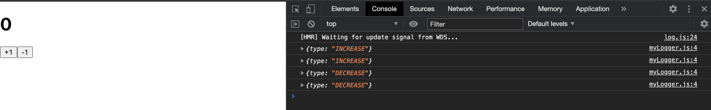
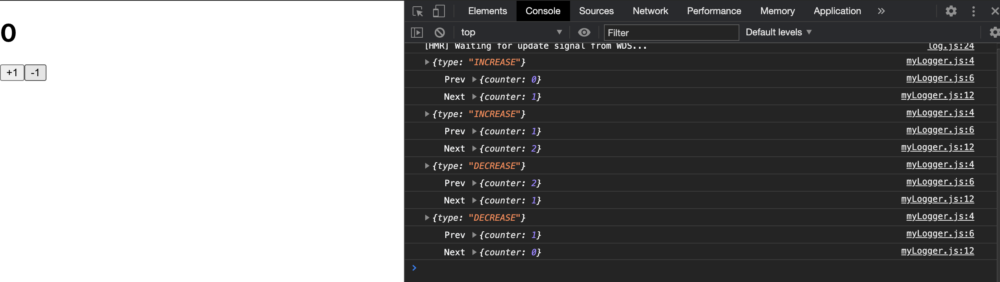
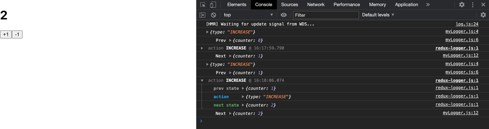

# 리덕스 미들웨어

- 리덕스가 지니고있는 핵심기능

- Context API / MOBX사용하는것과 차별화될 수 있는 강력한 기능

- 리덕스를 사용하는데 미들웨어를 사용하지 않은다면 context API 와 useReducer를 사용하는것이 나을 수 있다.
  => 리덕스를 사용하지 않아도 똑같은 작업 가능

- ```
  액션 => 미들웨어 => 리듀서 => 스토어
  
  액션이 디스패치 될 때 미들웨어에서 액션의 특정조건에따라 무시처리를 해줄 수 있다.
  = 리듀서에서 해당 액션을 처리하지 않는다.
  
  액션이 리듀서에게 전달되기 전에 특정코드를 실행할 수 있다.
  액션을 처리하는 과정에서 콘솔에 출력할 수 있고
  리듀서로 전달되기전에 액션을 수정할 수 있다 (payload값을 바꾼다거나..)
  
  액션이 디스패치 됬을 때 또다른 액션을 만들어 새로 디스패치 할 수도 있다.
  
  액션이 디스패치 되는과정에서 특정 조건에 따라 라우터에서 다른곳으로 이동한다던지
  액션을 기반해서 비동기 작업도 가능하다.
  
  특정 액션이 디스패치되면 API호출이 되고 성공적으로 끝나면 새로운 액션을 디스패치 하게끔도 가능하다.
  ```

- 주로 비동기 작업을 처리할 때 사용 (API 요청)

- 일반적으로 라이브러리로 만들어진 미들웨어를 사용한다.

  ex) **redux-thunk, redux-saga**, redux-observable, redux-promise-middleware ...

  

리덕스 미들웨어는 하나의 함수이다.

```js
const middleware = store => next => action => {
  // 하고싶은 작업...
}

// 함수를만드는 함수를만드는 함수
// 스토어를 파라미터로 받아온다 => 반환하는것이 함수
// store인스턴스 : subscribe / dispatch가 들어있다.
function middleware(store) {
  // next : 미들웨어에서 action을 받아왔을 때, 다음 미들웨어에게 전달하는 함수.
  // 미들웨어는 한 개 이상 사용가능하다.
  // 다음 미들웨어가 없다면 next를 통해서 reducer에 action을 전달해준다.
  // 미들웨어를 만들 때, 내부에 next를 호출하지 않으면 특정action을 무시할 수 있다.
  // = action무시 하면 reducer까지 전달되지 않는다.
  return function (next) {
    return function (action) {
      // 하고싶은 작업
      // action을 가지고 하고싶은 작업을 한다.
      // action은 액션객체이고
    };
  };
};
```

미들웨어 작성

```js
// 미들웨어
const myLogger = (store) => (next) => (action) => {
  // 액션이 디스패치 될 때, 콘솔에 출력하겠다.
  console.log(action);
  // action을 다음 미들웨어, 다음 미들웨어가 없다면 리듀서에 전달하겠다.
  const result = next(action);
  // container에서 디스패치 되었을 때 이 결과물
  return result;
};

export default myLogger;

```

미들웨어 적용 - index.js

```jsx
import React from "react";
import ReactDOM from "react-dom";
import "./index.css";
import App from "./App";
import * as serviceWorker from "./serviceWorker";
import { Provider } from "react-redux";
// 1. applyMiddleware 함수를 가져온다.
import { createStore, applyMiddleware } from "redux";
import rootReducer from "./modules";
import myLogger from "./middlewares/myLogger";

// 2. 두번째 파라미터로 넣어준다.
const store = createStore(rootReducer, applyMiddleware(myLogger));

ReactDOM.render(
  <Provider store={store}>
    <App />
  </Provider>,
  document.getElementById("root")
);

// If you want your app to work offline and load faster, you can change
// unregister() to register() below. Note this comes with some pitfalls.
// Learn more about service workers: https://bit.ly/CRA-PWA
serviceWorker.unregister();

```



```js
// 미들웨어
const myLogger = (store) => (next) => (action) => {
  // 액션이 디스패치 될 때, 콘솔에 출력하겠다.
  console.log(action);

  console.log("\tPrev", store.getState());

  // action을 다음 미들웨어, 다음 미들웨어가 없다면 리듀서에 전달하겠다.
  const result = next(action);

  // 탭 문자 + action이 리듀서에서 처리가 모두 되고난 후 다음상태를 콘솔에 출력해준다.
  console.log("\tNext", store.getState());

  // container에서 디스패치 되었을 때 이 결과물
  return result;
};

export default myLogger;

```



미들웨어에서 액션이 보통 객체인데, 함수도 받아오게 해서 action이 함수타입일때, 해당 액션함수를 호출할 수 있게 해준다
=> thunk : dispatch / getState를 파라미터로 받아와서 해당 함수 내부에서 다른 액션을 디스패치하는 패턴


## redux-logger

Redux-logger 사용 / 미들웨어와 DevTools 함께 사용

```jsx
import React from "react";
import ReactDOM from "react-dom";
import "./index.css";
import App from "./App";
import * as serviceWorker from "./serviceWorker";
import { Provider } from "react-redux";
import { createStore, applyMiddleware } from "redux";
import rootReducer from "./modules";
import myLogger from "./middlewares/myLogger";
import logger from "redux-logger";

const store = createStore(rootReducer, applyMiddleware(myLogger, logger));

ReactDOM.render(
  <Provider store={store}>
    <App />
  </Provider>,
  document.getElementById("root")
);

// If you want your app to work offline and load faster, you can change
// unregister() to register() below. Note this comes with some pitfalls.
// Learn more about service workers: https://bit.ly/CRA-PWA
serviceWorker.unregister();

```

```js
// 미들웨어
const myLogger = (store) => (next) => (action) => {
  console.log(action);
  console.log("\tPrev", store.getState());
  // 1. next(action)을 했을 때, 그 다음 미들웨어인 redux-logger이 실행되었고
  const result = next(action);
  // 2. 끝나고 나서 로깅을하니깐 mylogger - redux-logger - mylogger 순으로 작성된다.
  console.log("\tNext", store.getState());
  return result;
};

export default myLogger;

```




redux-devtools를 함께 쓰려면 

```js
import { composeWithDevTools } from "redux-devtools-extension";

const store = createStore(
  rootReducer,
   composeWithDevTools(applyMiddleware(logger))
);
```


## redux-thunk

- 액션 객체가 아닌 함수를 디스패치 할 수 있다.

- ```js
  const rhunk = store => next => action
  	typeof action === 'function'
  	? action(store.dispatch, store.getState)
  	: next(action)
  ```

- 액션을 디스패치, 현재상태를 조회할 수 있다.

- api요청 / 특정 promise를 다룰때 유용하다.

```js
export const increaseAsync = () => (dispatch) => {
  setTimeout(() => {
    dispatch(increase());
  }, 1000);
};

export const decreaseAsync = () => (dispatch) => {
  setTimeout(() => {
    dispatch(decrease());
  }, 1000);
};

/*
(dispatch) => {
  setTimeout(() => {
    dispatch(increase());
  }, 1000);
}; 
까지가 thunk 함수
*/

/*
() => (dispatch) => {
  setTimeout(() => {
    dispatch(increase());
  }, 1000);
};
thunk 함수를 만들어주는 함수(creator)
*/
```

